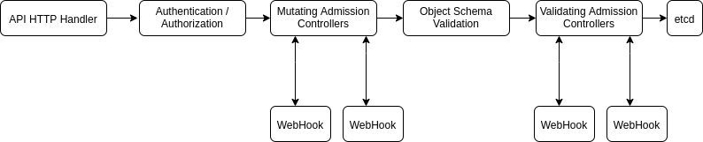
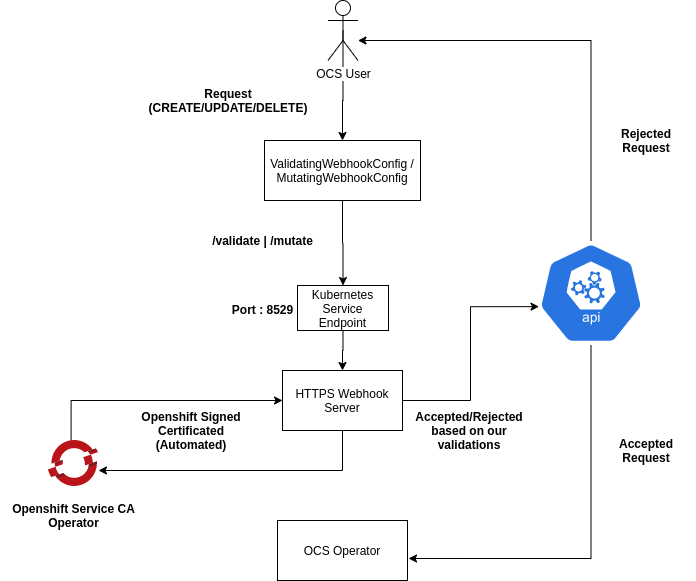

## Background

This proposal is to add support for admission controllers in OCS. An admission controller is a piece of code that intercepts requests to the Kubernetes API server prior to persistence of the object, but after the request is authenticated and authorized

 There are two special controllers: MutatingAdmissionWebhook and ValidatingAdmissionWebhook.
 
 Mutating controllers may modify the objects they admit but validation controllers are only allowed to validate requests.

## User Scenario

Listing out some use cases, where validators will be helpful,

**Securing the resources from CLI updates**

Currently, user can manipulate Custom Resource specs with any values and apply them through CLI which may result in OCS not functioning as expected. The present validation method in Kubernetes is the OpenAPI schema validation which can be used for basic validations like checking type of data, providing a range for the values etc but anything more complex (checking resource availability, network status, error handling) would not be possible under this scenario.

**Expansion/Adding Capacity**
Making sure that while adding capacity of an OCS cluster, the storage class that will be selected should have the same provisioner value as of the SC that was used to create the OCS cluster.

## Admission Controllers Concept



## Requirements

1. Webhook server which will validate the requests
2. TLS certificates for the server,
3. ValidatingWebhookConfig/MutatingWebhookConfig which will intercept requests and send a HTTPS request to the webhook server.
4. RBAC Components 

## Implementation 

As shown in the above diagram, the admission control process proceeds in two phases. In the first phase, mutating admission controllers are run. In the second phase, validating admission controllers are run. Note again that some of the controllers are both.

The admission controllers intercept requests based on the values given in the configuration. In this config, we have to provide the details on 
* What resources should it be looking for ? (Pods, Service)
* What api version and group does it belong to ? *Example : ApiVersion = (v1, v1beta) Group version = (admissionregistration.k8s.io)*
* What kind of operation should it intercept ? (Create, Update, Delete)
* A valid base64 encoded CA bundle.
* What path do we want to send with HTTPs request (/validate, /mutate)

A webhook server should be in place (*with valid TLS certificates*) to intercept any HTTPs request that comes with the above path value. Once the request is intercepted by the server, an [AdmissionRequest](https://github.com/kubernetes/api/blob/master/admission/v1beta1/types.go#L40) object is sent through with the resource specifications. 

When the webhook server receives Admission Request, it will perform predefined validations on the provided resource values and send back an [AdmissionResponse](https://github.com/kubernetes/api/blob/master/admission/v1beta1/types.go#L116) with the indication whether request is accepted or rejected.

If any of the controllers in either phase reject the request, the entire request is rejected immediately and an error is returned to the end-user.

## Certificate Management in OCP



As shown in the above diagram, In the OCP cluster, The management of certificates would be completely done by the Openshift Service CA Operator. This operator would be responsible for handling all the certificate management duties like generating and renewing them when OCS is deployed in Openshift Environment.

The first step would be to generate the certificates and assign them to the proper components. On annotating any service with 

`service.beta.openshift.io/serving-cert-secret-name:<secret-name>` 

We have to deploy the the annotated service at the start to generate the signed certificates. This can done manually  through the command 

`oc create -f ${SERVICE_NAME}.yaml`

For verifying 

`oc describe ${SERVICE_NAME} -n ${NAMESPACE}`

**Output**
```
oc describe service <service-name>
...
Annotations:              service.beta.openshift.io/serving-cert-secret-name: <service-name>
                          service.beta.openshift.io/serving-cert-signed-by: openshift-service-serving-signer@1556850837
```
The Openshift Sevice CA operator automatically generates a signed serving certificate and key pair into a secret in the same namespace as the service. 
This secret will be mounted onto the server pod. Our server would be looking for tls certificates and automatically set them for TLS communication.
For injecting a CA bundle onto the ValidatingWebhookConfig, we can annotate it with

`service.beta.openshift.io/inject-cabundle=true`

The operator on detecting this will set the ca bundle field in our config with a base64url-encoded CA signing bundle. These certificates will be automatically rotated and renewed by the service CA operator. This can also be done manually through the commands which can be found in the operator manual.